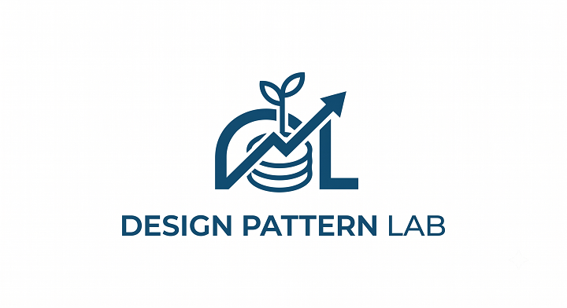

# Design Pattern Lab



GoF 23개 패턴을, 격리된 예제로 외우는 게 아니라 도메인 두 개를 직접 만들면서 "필요해서 생겨나는" 순간에 다시 발견하는 lab이에요. [docs/levels/](docs/levels/) 문서를 한 단계씩 따라가면 돼요. 레벨 0(시작)부터 차례로 열고요. 급할 거 없어요. 빨리 한다고 더 남는 것도 아니라서.

## 목표

두 개예요. 욕심은 안 부려요.

1. 디자인 패턴이 왜 필요한지를 머리 말고 손으로 체득해요.
2. 끝나면 외울 거리가 아니라 돌아가는 물건(미니 DB, 미니 스프링 골격)이 손에 남아요.

원래 이 둘은 같이 잡기 어려워요. 격리된 예제는 학습 신호는 깨끗한데 산출물이 안 남고, 도메인 하나로만 가면 산출물은 되는데 패턴이 잘 안 나오거든요. 그래서 도메인을 둘로 쪼개 서로의 사각지대를 메웠어요.

## 5대 원칙

앞으로 지겹게 반복할 거예요. 먼저 적어 둘게요.

1. **패턴부터 정하지 않아요.** "오늘은 이 패턴 쓰자"가 아니라 "이 변경 압력을 깔끔하게 풀려면?"에서 출발해요. 다 만든 뒤에 카탈로그랑 대조해서 재발견하고요.
2. **before -> 고통 -> after.** 일단 패턴 없이 동작시키고, 변경 요구로 직접 아파 본 다음, 그제야 리팩토링해요.
3. **억지로 끼워 맞추지 않아요.** 도메인이 요구 안 하면 안 넣어요. 개수 채우겠다고 넣는 순간 망합니다.
4. **안 쓴 이유도 적어요.** "규칙이 두세 개뿐이라 안 썼다", 이게 쓴 이유만큼 값져요.
5. **비용을 적어요.** 패턴은 공짜가 아니에요. 복잡도를 한 곳에서 딴 곳으로 옮기는 거래일 뿐이거든요.

## 구조

```
design-pattern-lab/
├── mini-db/          프로젝트 A: 쿼리 언어를 실행하는 미니 데이터베이스
│   ├── storage/      저장, 트랜잭션, 동시성   (lab.db.storage,   의존: 없음)
│   ├── engine/       실행                     (lab.db.engine,    의존: storage)
│   └── frontend/     파싱, 해석               (lab.db.frontend,  의존: engine)
├── mini-spring/      프로젝트 B: DI 컨테이너 + MVC
│   ├── container/    빈 등록, 주입            (lab.spring.container, 의존: 없음)
│   └── mvc/          요청 처리                (lab.spring.mvc,       의존: container)
├── integration/      접점: 미니 스프링이 미니 DB를 @Repository로 감쌈
│                                              (lab.integration, 의존: container, mvc, frontend, engine)
└── appendix/
    └── flyweight/    부록: Flyweight 관찰     (lab.appendix.flyweight, 의존: 없음)
```

의존 방향은 각 모듈의 `build.gradle.kts`가 컴파일 타임에 강제해요. storage에서 engine을 import하려 들면 빌드가 그냥 깨져요. 일부러 그렇게 묶어 둔 거예요. 이 경계를 지키는 훈련이 개별 패턴 지식보다 값지거든요.

## 진행 방식

- 한 단위 끝낼 때마다 [docs/README-template.md](docs/README-template.md) 틀로 회고를 남겨요.
- before/after는 격리 폴더 말고 git 커밋으로 남겨요. 권장 리듬은 이래요.
  1. 패턴 없이 동작하는 버전 커밋 (행동을 못 박는 테스트 포함)
  2. 변경 요구 추가해서 고통을 드러낸 커밋
  3. 리팩토링(패턴 도입) 커밋 (1의 테스트가 assert 수정 없이 그대로 초록이어야 리팩토링이에요)
  이렇게 쌓이면 커밋 로그 자체가 "이 패턴이 왜 들어왔나"의 서사가 돼요. 검증 요령은 [foundation](docs/levels/foundation.md)의 안전망 섹션에 있어요.

## 빌드 / 테스트

```bash
./gradlew build      # 전체 컴파일 + 테스트
./gradlew test       # 테스트만
./gradlew projects   # 모듈 트리 확인
```

JDK 21이 필요해요(Gradle toolchain이 알아서 골라 줘요). 빌드 도구는 Gradle wrapper로 고정해 놨으니 따로 깔 건 없고요.

## 현재 상태

레벨은 따로 노는 예제 24개가 아니에요. 프로젝트 둘을 레벨에 걸쳐 한 덩어리로 키워 가요. 그래서 공용 바닥이 하나 있어요.

- **토대 타입(운반체)은 깔려 있어요.** `Row`, `Table`(engine), `Page`(storage) 같은 데이터 그릇이요. 그냥 import해서 써요. 정체와 쓰는 법은 [docs/levels/foundation.md](docs/levels/foundation.md)에 모아 뒀어요. 레벨 1 전에 한 번 훑어요.
- **패턴(구조)은 본인이 채워요.** `Query`, 조건 트리, 빈 팩토리 같은 거요. 이걸 어떻게 조직하느냐가 곧 각 레벨의 패턴이라 미리 안 줘요. 그 외 모듈은 층 책임이랑 등장 예정 패턴을 적은 `package-info.java`랑 스모크 테스트만 있고요.
